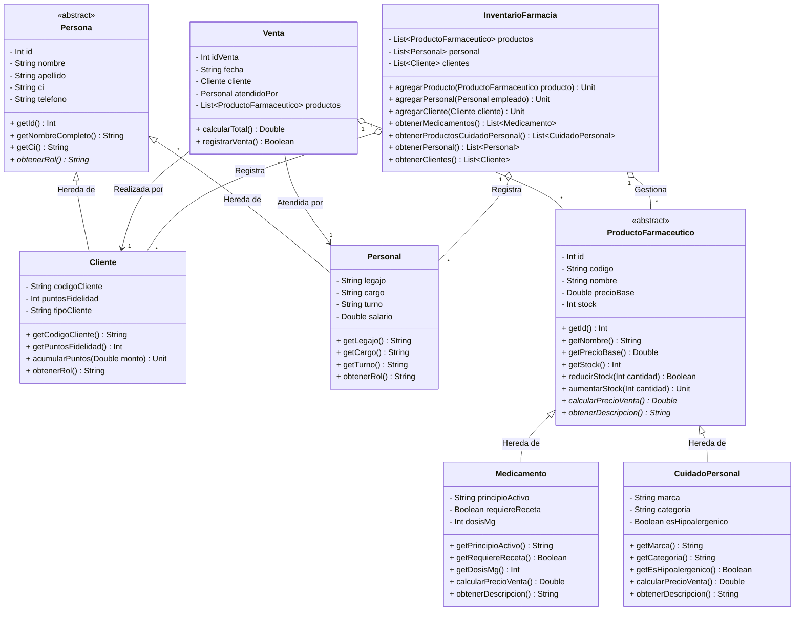

# Checkpoint 1: Modelo y Diagrama de Clases - Caso de Estudio: Farmacia

## 1. Descripción del Caso de Estudio
El sistema está diseñado para la gestión integral de una **Farmacia**, permitiendo administrar tanto el catálogo de productos (Medicamentos y Cuidado Personal) como el registro de **Personal (Empleados)**, **Clientes** y **Atención/Ventas**. 

Se aplican los principios de la Programación Orientada a Objetos (POO): **Herencia, Encapsulamiento, Polimorfismo, Abstracción y Asociación**.

---

## 2. Diagrama de Clases (Mermaid)

---

## 3. Detalle de Clases, Atributos y Métodos

### 3.1. Jerarquía de Personas (Abstracción y Herencia)

#### Clase Abstracta: `Persona`
Entidad base para cualquier individuo registrado en la farmacia.
* **Atributos Encapsulados:**
  * `id: Int`: Identificador único.
  * `nombre: String`: Nombre(s).
  * `apellido: String`: Apellidos.
  * `ci: String`: Cédula de Identidad / DNI.
  * `telefono: String`: Teléfono de contacto.
* **Métodos:**
  * `getNombreCompleto(): String`: Retorna `"nombre apellido"`.
  * `obtenerRol(): String` *(Método Abstracto)*: Define la función en la farmacia.

#### Clase Derivada: `Cliente` (Hereda de `Persona`)
Representa a los compradores y usuarios de la farmacia.
* **Atributos Específicos:**
  * `codigoCliente: String`: Código de cliente preferencial.
  * `puntosFidelidad: Int`: Puntos acumulados por compras.
  * `tipoCliente: String`: Categoría (ej. "Regular", "VIP", "Tercera Edad").
* **Métodos:**
  * `acumularPuntos(monto: Double)`: Suma 1 punto por cada $10 gastados.
  * `obtenerRol()`: Retorna `"Cliente [tipoCliente]"`.

#### Clase Derivada: `Personal` (Hereda de `Persona`)
Representa a los empleados (farmacéuticos, cajeros, administradores) que atienden en la farmacia.
* **Atributos Específicos:**
  * `legajo: String`: Código de empleado.
  * `cargo: String`: Puesto de trabajo (ej. "Farmacéutico Titular", "Cajero", "Auxiliar").
  * `turno: String`: Turno laboral (ej. "Mañana", "Tarde", "Noche").
  * `salario: Double`: Salario base del empleado.
* **Métodos:**
  * `obtenerRol()`: Retorna `"Personal - [cargo] (Turno [turno])"`.

---

### 3.2. Jerarquía de Productos Farmacéuticos

#### Clase Abstracta: `ProductoFarmaceutico`
* **Atributos:** `id: Int`, `codigo: String`, `nombre: String`, `precioBase: Double`, `stock: Int`.
* **Métodos:** `reducirStock()`, `aumentarStock()`, `calcularPrecioVenta()` *(Abstracto)*, `obtenerDescripcion()` *(Abstracto)*.

#### Clase Derivada: `Medicamento`
* **Atributos Específicos:** `principioActivo: String`, `requiereReceta: Boolean`, `dosisMg: Int`.
* **Polimorfismo:** Si requiere receta médica no paga IVA (0%); de lo contrario paga el IVA legal (13%).

#### Clase Derivada: `CuidadoPersonal`
* **Atributos Específicos:** `marca: String`, `categoria: String`, `esHipoalergenico: Boolean`.
* **Polimorfismo:** Precio de venta = `precioBase` + IVA + Recargo cosmético (10%).

---

### 3.3. Transacción: `Venta`
Asocia el cliente, el empleado que atiende y los productos adquiridos.
* **Atributos:** `idVenta: Int`, `fecha: String`, `cliente: Cliente`, `atendidoPor: Personal`, `productos: List<ProductoFarmaceutico>`.
* **Métodos:**
  * `calcularTotal(): Double`: Suma el `calcularPrecioVenta()` de todos los productos en la venta.
  * `registrarVenta(): Boolean`: Procesa la transacción y descuenta el stock.

---

### 3.4. Gestor Global: `InventarioFarmacia`
Gestor central para administrar la colección de datos.
* **Listas:** `productos`, `personal`, `clientes`.
* **Métodos:**
  * `agregarProducto()`, `agregarPersonal()`, `agregarCliente()`.
  * `obtenerMedicamentos()`, `obtenerProductosCuidadoPersonal()`, `obtenerPersonal()`, `obtenerClientes()`.

---

## 4. Estado de los Checkpoints

1. **Checkpoint 1 – Diseño de clases (15 pts):** Modelo conceptual actualizado con Clientes y Personal de Farmacia.
2. **Checkpoint 2 – Implementación (10 pts):** Creación de las clases Kotlin (`Persona`, `Cliente`, `Personal`, `ProductoFarmaceutico`, `Medicamento`, `CuidadoPersonal`, `Venta`, `InventarioFarmacia`).
3. **Checkpoint 3 – Scripts (10 pts):** Script de carga inicial de productos, empleados y clientes.
4. **Checkpoint 4 – Diseño de Interfaz (30 pts):** Planificación de pantallas Jetpack Compose.
5. **Checkpoint 5 – Interfaz (20 pts):** Construcción de las 2 pantallas en Jetpack Compose.
6. **Checkpoint 6 – Compilación y Ejecución (15 pts):** Ejecución y prueba final.
