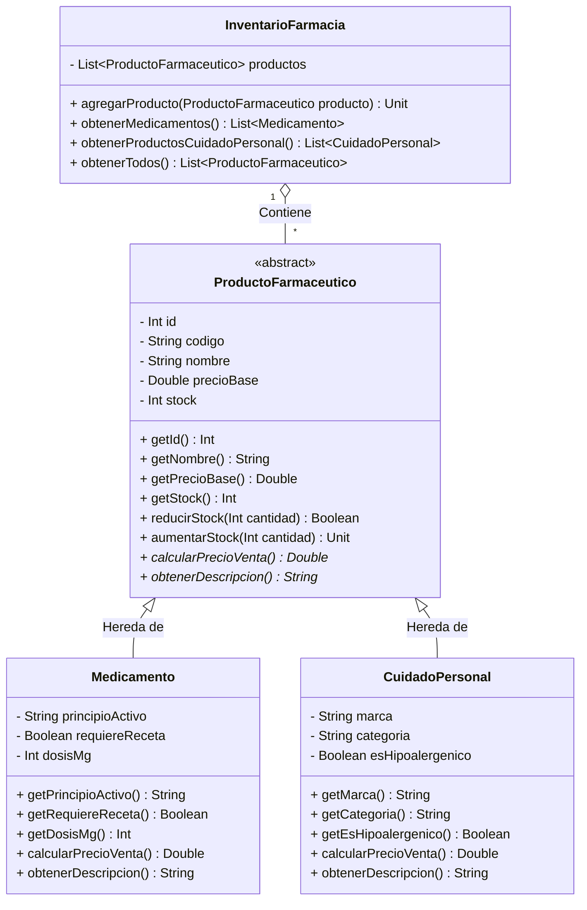

# Checkpoint 1: Modelo y Diagrama de Clases - Caso de Estudio: Farmacia

## 1. Descripción del Caso de Estudio
El sistema está diseñado para la gestión de productos en una **Farmacia**, permitiendo categorizar y administrar diferentes tipos de artículos farmacéuticos (Medicamentos y Productos de Cuidado Personal / Cosmética). Se aplican los principios de la Programación Orientada a Objetos (POO): **Herencia, Encapsulamiento, Polimorfismo y Abstracción**.

---

## 2. Diagrama de Clases (Mermaid)

---

## 3. Detalle de Clases, Atributos y Métodos

### 3.1. Clase Abstracta: `ProductoFarmaceutico`
Representa la entidad base de cualquier producto en la farmacia.
* **Atributos (Encapsulados):**
  * `id: Int`: Identificador único del producto.
  * `codigo: String`: Código de barras o clave del producto.
  * `nombre: String`: Nombre comercial.
  * `precioBase: Double`: Precio de costo / base del producto.
  * `stock: Int`: Cantidad disponible en inventario.
* **Métodos:**
  * `reducirStock(cantidad: Int): Boolean`: Disminuye el stock si hay disponible.
  * `aumentarStock(cantidad: Int)`: Incrementa el stock disponible.
  * `calcularPrecioVenta(): Double` *(Método Abstracto)*: Define la lógica del precio final con impuestos/descuentos aplicables.
  * `obtenerDescripcion(): String` *(Método Abstracto)*: Retorna una síntesis descriptiva del producto.

### 3.2. Clase Derivada: `Medicamento` (Hereda de `ProductoFarmaceutico`)
Representa los medicamentos fármacos en la farmacia.
* **Atributos Específicos:**
  * `principioActivo: String`: Compuesto químico principal (ej. Paracetamol, Ibuprofeno).
  * `requiereReceta: Boolean`: Indica si su venta exige receta médica.
  * `dosisMg: Int`: Concentración del principio activo en miligramos (ej. 500 mg).
* **Polimorfismo:**
  * `calcularPrecioVenta()`: Si el medicamento **requiere receta**, se le exime del IVA (0% impuesto); si es de venta libre, aplica el IVA estándar (13%/16%).
  * `obtenerDescripcion()`: Retorna formato `"Medicamento: [Nombre] ([dosisMg]mg) - Principio Activo: [principioActivo]"`.

### 3.3. Clase Derivada: `CuidadoPersonal` (Hereda de `ProductoFarmaceutico`)
Representa productos de higiene, cosmética y cuidado de la piel.
* **Atributos Específicos:**
  * `marca: String`: Marca comercial (ej. Nivea, Cerave).
  * `categoria: String`: Subcategoría (ej. Dermocosmética, Capilar, Corporal).
  * `esHipoalergenico: Boolean`: Indica si es apto para pieles sensibles.
* **Polimorfismo:**
  * `calcularPrecioVenta()`: Aplica precio base + IVA estándar + un recargo por categoría cosmética (10%).
  * `obtenerDescripcion()`: Retorna formato `"Cuidado Personal: [Nombre] - Marca: [marca] ([categoria])"`.

### 3.4. Clase Gestora: `InventarioFarmacia`
Gestor en memoria para administrar la colección de objetos implementados.
* **Atributos:**
  * `productos: MutableList<ProductoFarmaceutico>`
* **Métodos:**
  * `agregarProducto(producto: ProductoFarmaceutico)`
  * `obtenerMedicamentos(): List<Medicamento>`
  * `obtenerProductosCuidadoPersonal(): List<CuidadoPersonal>`
  * `obtenerTodos(): List<ProductoFarmaceutico>`

---

## 4. Resumen de Checkpoints del Proyecto

1. **Checkpoint 1 – Diseño de clases (15 pts):** Creación del modelo conceptual, documentación y primer commit.
2. **Checkpoint 2 – Implementación (10 pts):** Creación de las clases Kotlin con POO.
3. **Checkpoint 3 – Scripts (10 pts):** Carga de datos de prueba / scripts iniciales.
4. **Checkpoint 4 – Diseño de Interfaz (30 pts):** Planificación de componentes Jetpack Compose para las 2 pantallas.
5. **Checkpoint 5 – Interfaz (20 pts):** Construcción de las 2 pantallas en Jetpack Compose.
6. **Checkpoint 6 – Compilación y Ejecución (15 pts):** Verificación final y ejecución sin errores.
